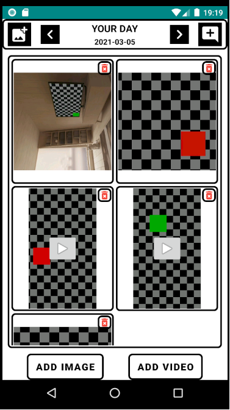
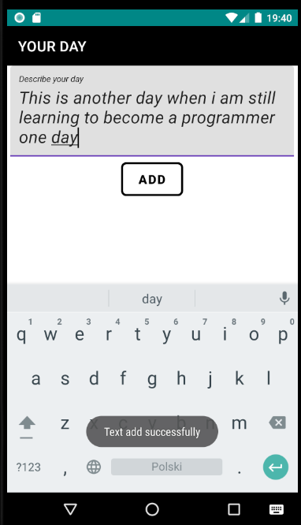

 # Your Day App

Memories of the day app created with Java and SQLite.

 

---

 # General info
It is a simple application used to store pictures and video as a souvenir of the day.
It was created at the request of a girl who did not like the functionality of the application available on the market.

 ## Features
- Make souvenirs directly through the apps
- Import image and video from gallery
- Save files to a specific date
- Add a note describing your day

### To do:
- Cloud backup
- Creating user accounts

## License

**MIT**

*Free Software*
